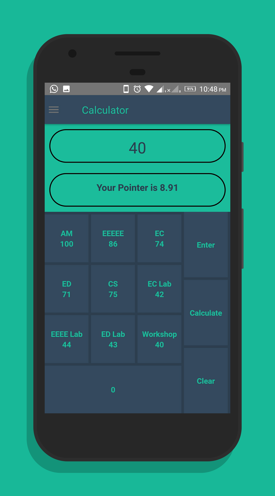
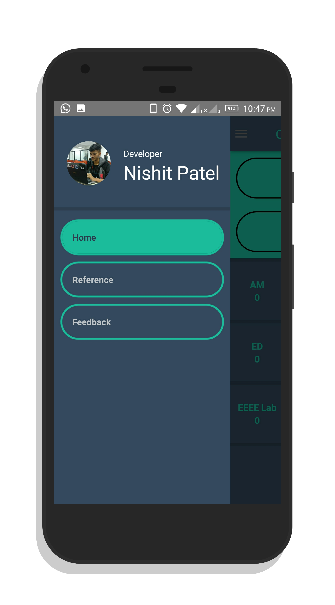
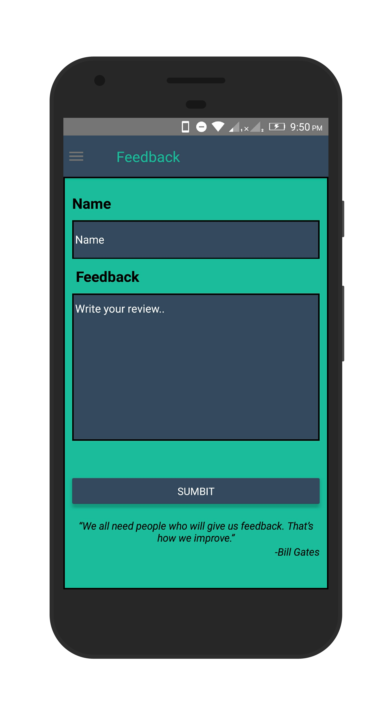

#  
Pointer Calculator App (Ponter Calc) 

### Download link for apk file [Google Drive](https://drive.google.com/open?id=1i4c65iuF_KFo0Bf77lICUeGwBBSQsl8K)

<b>Short Info </b>
It is a Native app build using React-native and is compatiple with both Android and IOS 

# Contribute
#### This project still has scope of development, so you can also contribute to this Project as follows:
* [Fork](https://github.com/nis130/Pointer-Calulator-App) this Repository
* Clone your Fork on a different branch:
	* `git clone -b <name-of-branch> https://github.com/nis130/Pointer-Calulator-App.git`
* After adding any feature:
	* Goto your fork and create a pull request.
	* We will test your modifications and merge changes.
	
## 🧐 Screenshots

